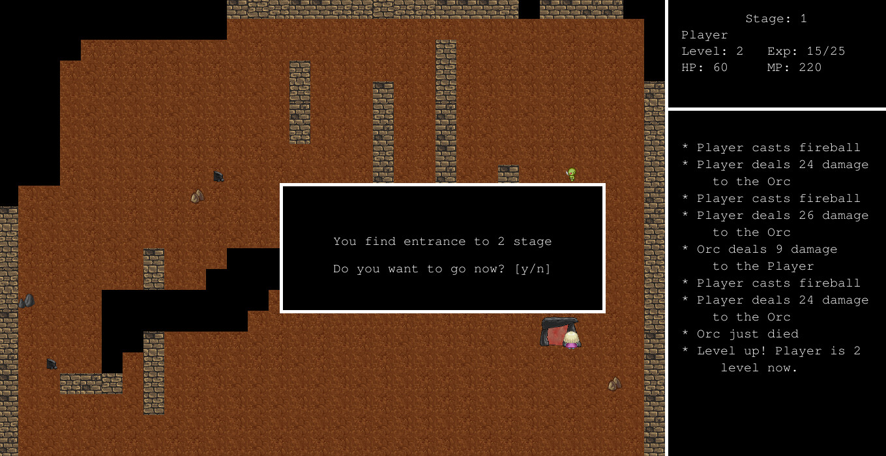

## KPHP Game



## About

This is a game written in PHP using [kphp-sdlite](https://packagist.org/packages/quasilyte/kphp-sdlite) library.

This game features:

* Audio processing (music, sound effects)
* Animations (spell effects)
* Text rendering and UI components
* Event polling (keyboard controls)

It's a showcase that KPHP can be used to build applications like this.

Note that this game is written in 1 day during a hackathon.
The code quality may be lacking.

## Building a game

You will need a [KPHP](https://github.com/VKCOM/kphp/) that supports [FFI](https://wiki.php.net/rfc/ffi).
If [Pull295](https://github.com/VKCOM/kphp/pull/295) is not merged yet, you'll need to build a kphp2cpp from that branch.

Our build scripts expect a symlink to an appropriate kphp2cpp in the root of the project.

Example layout:

```
kphp-game/
  kphp2cpp <- this is a symlink you need to provide
  scripts/...
  src/...
```

```bash
# If successfull, game binary can be found at ./bin/game
$ make game
```

Tested on:

* Ubuntu (amd64 platform)
* Mac OS (amd64 platform)

## Running with PHP

```bash
$ make run-with-php
```

## Playing the game

Controls:

* `Q` - use first spell, **fireball**
* `W` - use second spell, **ice shards**
* `E` - use third spell, **thunder**
* arrows (left, right, up, down) - move
* `Esc` - exit game
* `y` (when asked) - accept
* `n` (when asked) - decline

## Credits

This game uses some sounds and artworks from existing video games.

All assets keep their original copyright and can't be considered to be MIT-licensed.

The authors of this game have no copyrights of these assets.
